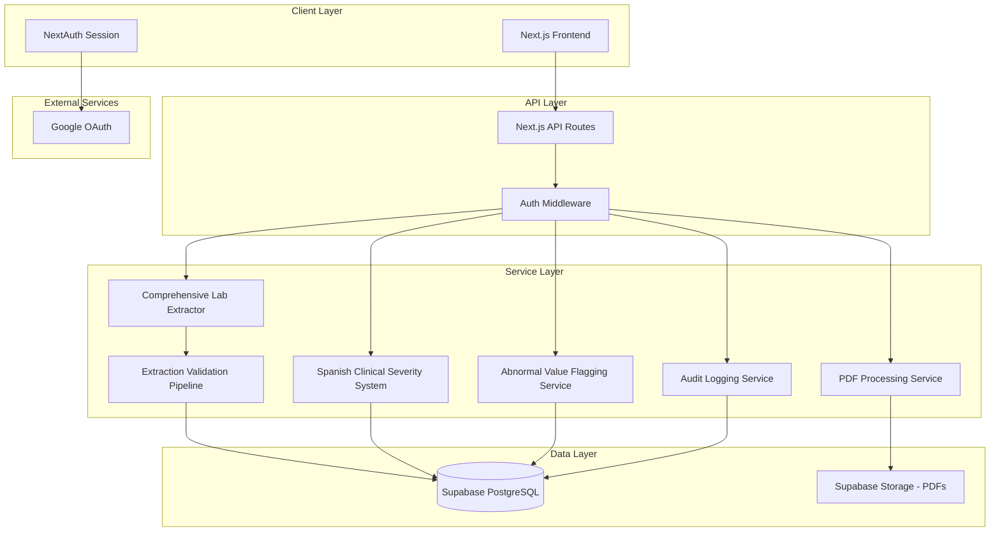

# Design Document

## Overview

The Lab Result Prioritization System is a Next.js web application that automates the review and prioritization of blood test results for Chile's public primary care centers. The system uses a modular architecture to support the core MVP functionality while providing a foundation for future feature expansion.

**Key Design Principles:**
- Modular architecture for easy feature addition/removal
- Security-first approach for healthcare data
- Scalable foundation for future integrations
- Focus on PDF parsing accuracy and reliability
- Responsive design for various devices

## Architecture

### Current Implementation Architecture



### Technology Stack

**Frontend:**
- Next.js 14+ with App Router
- TypeScript for type safety
- Tailwind CSS for styling
- React Hook Form for form handling
- Zustand for client state management
- next-intl for internationalization (Spanish primary, English fallback)

**Backend:**
- Next.js API Routes
- NextAuth.js for authentication
- PDF parsing: pdf-parse optimized for serverless deployment
- Comprehensive extraction engine with 68+ health marker patterns
- Spanish clinical terminology processing with severity classification
- Multi-format reference range parsing system

**Database & Storage:**
- Supabase PostgreSQL for structured data
- Supabase Storage for PDF files
- Row Level Security (RLS) for data protection

**Deployment:**
- Vercel for hosting and deployment
- Environment-based configuration

## Components and Interfaces

### Core Modules

#### 1. Authentication Module
```typescript
interface AuthModule {
  // NextAuth configuration
  providers: GoogleProvider[]
  callbacks: {
    signIn: (user, account, profile) => boolean
    session: (session, token) => Session
    jwt: (token, user, account) => JWT
  }
  
  // User management
  createUserProfile: (googleUser) => UserProfile
  updateUserRole: (userId, role) => void
  validatePermissions: (userId, action) => boolean
}

interface UserProfile {
  id: string
  email: string
  name: string
  role: 'healthcare_worker' | 'admin'
  healthcareRole?: 'nurse' | 'medic' | 'nutritionist' | 'psychologist' | 'social_worker' | 'administrative'
  createdAt: Date
  lastLogin: Date
}
```

#### 2. PDF Processing Module
```typescript
interface PDFProcessingModule {
  uploadPDF: (file: File, userId: string) => Promise<UploadResult>
  extractText: (pdfBuffer: Buffer) => Promise<string>
  extractPatientInfo: (text: string, pageNumber?: number) => Promise<PatientInfo>
  validatePDF: (file: File) => ValidationResult
  storePDF: (file: File, patientId: string) => Promise<string>
  validateParsing: (extractedData: ParsedLabData, originalText: string) => Promise<ValidationResult>
}

interface UploadResult {
  success: boolean
  pdfId?: string
  patientInfo?: PatientInfo
  validationResult?: ValidationResult
  errors?: string[]
}

interface PatientInfo {
  name?: string
  rut?: string
  age?: string
  sex?: string
  folio?: string
  solicitingDoctor?: string
  fechaIngreso?: Date
  tomaMuestra?: Date
  fechaValidacion?: Date
  procedencia?: string
  testDate?: Date
  laboratoryName?: string
}

interface ValidationResult {
  confidence: number // 0-100
  autoApproved: boolean
  requiresManualReview: boolean
  issues: string[]
  criticalValueDetected: boolean
  structuralIntegrity: number
  contentAccuracy: number
  healthcareLogicScore: number
}
```

#### 3. Comprehensive Lab Extraction Module
```typescript
interface ComprehensiveLabExtractorModule {
  extractAllHealthMarkers: (pdfText: string) => Promise<LabExtractionResult>
  classifySpanishSeverity: (markers: HealthMarker[]) => SeverityDistribution
  validateExtractionConfidence: (extraction: LabExtractionResult) => ConfidenceMetrics
  processChileanLabFormat: (pdfPages: string[]) => ChileanLabReport
  calculateCoverageScore: (extracted: HealthMarker[], expected: string[]) => number
}

interface HealthMarker {
  type: string // Standardized marker type
  spanishName: string // Original Spanish lab name
  value: number | string
  unit: string
  normalRange: NormalRange
  extractedText: string
  confidence: number
  isAbnormal: boolean
  abnormalIndicator?: string // [ * ] or other Chilean indicators
  severity: 'normal' | 'leve' | 'moderado' | 'severo' | 'crítico'
  isCriticalValue: boolean
  sampleType?: string // SUERO, SANGRE TOTAL, ORINA
}

interface LabExtractionResult {
  markers: HealthMarker[]
  patientInfo: PatientInfo
  overallConfidence: number
  coveragePercentage: number
  extractionTimestamp: Date
  processingTimeMs: number
}

interface SeverityDistribution {
  crítico: number
  severo: number
  moderado: number
  leve: number
  normal: number
  totalAbnormal: number
}

interface NormalRange {
  min?: number
  max?: number
  unit: string
  source: string // 'pdf' | 'database' | 'manual'
  rawText: string // Original reference text from PDF
  lastUpdated: Date
}

interface HealthcareValidation {
  valuesWithinReasonableRanges: boolean
  unitsMatchMarkers: boolean
  criticalValueFlags: {
    extremelyHighGlucose: boolean
    extremelyLowValues: boolean
    impossibleCombinations: boolean
  }
  medicalLogicScore: number
}
```

#### 4. Spanish Clinical Severity System
```typescript
interface SpanishSeverityClassificationModule {
  classifySeverity: (marker: HealthMarker) => SpanishSeverityLevel
  calculatePercentageDeviation: (value: number, range: NormalRange) => number
  flagCriticalValues: (markers: HealthMarker[]) => CriticalValueAlert[]
  calculateDynamicPriorityScore: (distribution: SeverityDistribution) => number
  updatePatientRiskProfile: (patientId: string, severity: SeverityDistribution) => Promise<void>
}

interface SpanishSeverityLevel {
  severity: 'normal' | 'leve' | 'moderado' | 'severo' | 'crítico'
  deviationPercentage: number
  clinicalSignificance: string
  requiresImmediateAttention: boolean
}

interface CriticalValueAlert {
  markerId: string
  markerName: string
  value: number | string
  criticalThreshold: number
  riskLevel: 'life-threatening' | 'urgent' | 'moderate'
  recommendedAction: string
  flaggedAt: Date
}
```

#### 5. Dashboard Module
```typescript
interface DashboardModule {
  getPrioritizedPatients: (filters: PatientFilters) => Promise<PatientSummary[]>
  getPatientDetails: (patientId: string) => Promise<PatientDetails>
  updatePatientStatus: (patientId: string, status: PatientStatus) => Promise<void>
  searchPatients: (query: string) => Promise<PatientSummary[]>
}

interface PatientSummary {
  id: string
  name: string
  rut: string
  priorityScore: number
  lastTestDate: Date
  abnormalMarkers: string[]
  status: 'pending' | 'contacted' | 'processed'
}

interface PatientFilters {
  dateRange?: { start: Date; end: Date }
  markerTypes?: string[]
  priorityLevel?: 'high' | 'medium' | 'low'
  status?: PatientStatus
}
```

## Data Models

### Database Schema

```sql
-- Users table
CREATE TABLE users (
  id UUID PRIMARY KEY DEFAULT gen_random_uuid(),
  email VARCHAR(255) UNIQUE NOT NULL,
  name VARCHAR(255) NOT NULL,
  role VARCHAR(50) NOT NULL DEFAULT 'healthcare_worker',
  healthcare_role VARCHAR(50),
  created_at TIMESTAMP DEFAULT NOW(),
  last_login TIMESTAMP,
  updated_at TIMESTAMP DEFAULT NOW()
);

-- Patients table
CREATE TABLE patients (
  id UUID PRIMARY KEY DEFAULT gen_random_uuid(),
  name VARCHAR(255) NOT NULL,
  rut VARCHAR(20) UNIQUE NOT NULL,
  created_at TIMESTAMP DEFAULT NOW(),
  updated_at TIMESTAMP DEFAULT NOW()
);

-- Lab reports table
CREATE TABLE lab_reports (
  id UUID PRIMARY KEY DEFAULT gen_random_uuid(),
  patient_id UUID REFERENCES patients(id),
  uploaded_by UUID REFERENCES users(id),
  pdf_url VARCHAR(500) NOT NULL,
  test_date DATE,
  laboratory_name VARCHAR(255),
  priority_score INTEGER DEFAULT 0,
  status VARCHAR(50) DEFAULT 'pending',
  created_at TIMESTAMP DEFAULT NOW(),
  updated_at TIMESTAMP DEFAULT NOW()
);

-- Health markers table
CREATE TABLE health_markers (
  id UUID PRIMARY KEY DEFAULT gen_random_uuid(),
  lab_report_id UUID REFERENCES lab_reports(id),
  marker_type VARCHAR(100) NOT NULL,
  value DECIMAL(10,3) NOT NULL,
  unit VARCHAR(20) NOT NULL,
  extracted_text TEXT,
  confidence DECIMAL(3,2),
  created_at TIMESTAMP DEFAULT NOW()
);

-- Normal ranges table
CREATE TABLE normal_ranges (
  id UUID PRIMARY KEY DEFAULT gen_random_uuid(),
  marker_type VARCHAR(100) NOT NULL,
  min_value DECIMAL(10,3) NOT NULL,
  max_value DECIMAL(10,3) NOT NULL,
  unit VARCHAR(20) NOT NULL,
  source VARCHAR(255),
  created_at TIMESTAMP DEFAULT NOW(),
  updated_at TIMESTAMP DEFAULT NOW()
);

-- Abnormal flags table
CREATE TABLE abnormal_flags (
  id UUID PRIMARY KEY DEFAULT gen_random_uuid(),
  health_marker_id UUID REFERENCES health_markers(id),
  severity VARCHAR(20) NOT NULL,
  is_above_range BOOLEAN NOT NULL,
  is_below_range BOOLEAN NOT NULL,
  flagged_at TIMESTAMP DEFAULT NOW()
);

-- Audit logs table
CREATE TABLE audit_logs (
  id UUID PRIMARY KEY DEFAULT gen_random_uuid(),
  user_id UUID REFERENCES users(id),
  action VARCHAR(100) NOT NULL,
  resource_type VARCHAR(50) NOT NULL,
  resource_id UUID,
  patient_rut VARCHAR(20),
  ip_address INET,
  user_agent TEXT,
  created_at TIMESTAMP DEFAULT NOW()
);
```

### Row Level Security (RLS) Policies

```sql
-- Enable RLS on all tables
ALTER TABLE users ENABLE ROW LEVEL SECURITY;
ALTER TABLE patients ENABLE ROW LEVEL SECURITY;
ALTER TABLE lab_reports ENABLE ROW LEVEL SECURITY;
ALTER TABLE health_markers ENABLE ROW LEVEL SECURITY;
ALTER TABLE abnormal_flags ENABLE ROW LEVEL SECURITY;
ALTER TABLE audit_logs ENABLE ROW LEVEL SECURITY;

-- Users can only see their own profile
CREATE POLICY "Users can view own profile" ON users
  FOR SELECT USING (auth.uid() = id);

-- Healthcare workers can view all patients and lab reports
CREATE POLICY "Healthcare workers can view patients" ON patients
  FOR SELECT USING (
    EXISTS (
      SELECT 1 FROM users 
      WHERE users.id = auth.uid() 
      AND users.role IN ('healthcare_worker', 'admin')
    )
  );

-- Only admins can view audit logs
CREATE POLICY "Admins can view audit logs" ON audit_logs
  FOR SELECT USING (
    EXISTS (
      SELECT 1 FROM users 
      WHERE users.id = auth.uid() 
      AND users.role = 'admin'
    )
  );
```

## Error Handling

### Error Classification

1. **User Errors**: Invalid file uploads, missing patient information
2. **System Errors**: PDF parsing failures, database connection issues
3. **Security Errors**: Unauthorized access attempts, session timeouts
4. **External Service Errors**: Google OAuth failures, Supabase outages

### Error Handling Strategy

```typescript
interface ErrorHandler {
  handlePDFParsingError: (error: Error, context: PDFContext) => UserFriendlyError
  handleDatabaseError: (error: Error, operation: string) => UserFriendlyError
  handleAuthError: (error: Error) => UserFriendlyError
  logError: (error: Error, context: ErrorContext) => void
}

interface UserFriendlyError {
  message: string
  code: string
  suggestions: string[]
  retryable: boolean
}
```

### Graceful Degradation

- **PDF Parsing Failure**: Flag for manual review, allow manual data entry
- **Database Connectivity**: Show cached data when possible, queue operations
- **Authentication Issues**: Clear guidance for re-authentication
- **File Upload Issues**: Clear validation messages and retry options

## Testing Strategy

### Testing Pyramid

1. **Unit Tests** (70%)
   - PDF parsing functions
   - Health marker extraction logic
   - Flagging algorithms
   - Utility functions

2. **Integration Tests** (20%)
   - API route testing
   - Database operations
   - Authentication flows
   - File upload processes

3. **End-to-End Tests** (10%)
   - Complete user workflows
   - Critical path testing
   - Cross-browser compatibility

### Test Data Strategy

```typescript
interface TestDataFactory {
  createMockPDF: (markers: HealthMarker[], language?: 'es' | 'en') => Buffer
  createPatientData: (overrides?: Partial<Patient>) => Patient
  createLabReport: (abnormalMarkers?: string[]) => LabReport
  createUserSession: (role: UserRole) => Session
  createSpanishLabReport: (markers: HealthMarker[]) => Buffer // Chilean lab format
  createValidationTestCases: () => ValidationTestCase[]
}

interface ValidationTestCase {
  name: string
  pdfContent: string
  expectedExtraction: ParsedLabData
  expectedConfidence: number
  shouldAutoApprove: boolean
  criticalValues: boolean
}
```

### Parse Validation Strategy

#### Automated Validation Pipeline
```typescript
interface ParseValidationModule {
  validateStructure: (pdfText: string, extractedData: ParsedLabData) => StructuralValidation
  validateContent: (extractedData: ParsedLabData) => ContentValidation
  validateHealthcareLogic: (extractedData: ParsedLabData) => HealthcareValidation
  calculateOverallConfidence: (validations: ValidationResults) => number
  determineReviewRequirement: (confidence: number, criticalValues: boolean) => ReviewRequirement
}

interface StructuralValidation {
  pdfReadable: boolean
  patientInfoPresent: boolean
  labSectionsDetected: number
  expectedHeadersFound: string[]
  dateConsistency: boolean
  score: number
}

interface ContentValidation {
  patientDataComplete: {
    rut: boolean
    name: boolean
    age: boolean
    sex: boolean
    folio: boolean
  }
  labResultsValid: {
    hasNumericValues: boolean
    hasUnits: boolean
    hasReferenceRanges: boolean
    abnormalFlagsDetected: boolean
  }
  score: number
}

interface ReviewRequirement {
  autoApproved: boolean // confidence >= 85%
  requiresSpotCheck: boolean // confidence 70-84%
  requiresManualReview: boolean // confidence < 70%
  criticalValueOverride: boolean // critical values always need validation
}
```

#### Optimization: First Page Patient Parsing
```typescript
interface OptimizedPDFParser {
  parsePatientInfoFromFirstPage: (pdfPages: string[]) => PatientInfo
  parseLabResultsFromAllPages: (pdfPages: string[]) => HealthMarker[]
  avoidDuplicatePatientData: (extractedData: ParsedLabData) => ParsedLabData
}
```

### Performance Testing

- **Load Testing**: Validate concurrent PDF processing capabilities
- **Processing Performance**: Target processing time under 30 seconds for comprehensive reports
- **Extraction Accuracy**: Maintain confidence scores above 85% for production deployment
- **Database Performance**: Optimize queries for real-time patient prioritization

## Internationalization and Language Support

### Spanish Language Implementation

**Frontend Localization:**
```typescript
interface LocalizationConfig {
  defaultLocale: 'es' // Spanish as primary language
  fallbackLocale: 'en' // English fallback
  supportedLocales: ['es', 'en']
  
  // Spanish translations for UI elements
  translations: {
    dashboard: {
      title: 'Panel de Resultados de Laboratorio'
      priorityHigh: 'Prioridad Alta'
      priorityMedium: 'Prioridad Media'
      priorityLow: 'Prioridad Baja'
      patientName: 'Nombre del Paciente'
      rut: 'RUT'
      uploadDate: 'Fecha de Carga'
      abnormalMarkers: 'Marcadores Anormales'
      contacted: 'Contactado'
      pending: 'Pendiente'
    }
    upload: {
      title: 'Cargar Resultado de Laboratorio'
      selectFile: 'Seleccionar Archivo PDF'
      patientInfo: 'Información del Paciente'
      processing: 'Procesando...'
    }
    // ... more translations
  }
}
```

**Spanish PDF Parsing Patterns:**
```typescript
interface SpanishHealthMarkerPatterns {
  glucose: {
    keywords: ['glucosa', 'glicemia', 'azúcar en sangre']
    units: ['mg/dl', 'mg/dL', 'mmol/L']
    patterns: [
      /glucosa\s*:?\s*(\d+(?:\.\d+)?)\s*(mg\/dl|mmol\/L)/i,
      /glicemia\s*:?\s*(\d+(?:\.\d+)?)\s*(mg\/dl|mmol\/L)/i
    ]
  }
  cholesterol: {
    keywords: ['colesterol', 'colesterol total']
    units: ['mg/dl', 'mg/dL', 'mmol/L']
    patterns: [
      /colesterol\s*total?\s*:?\s*(\d+(?:\.\d+)?)\s*(mg\/dl|mmol\/L)/i
    ]
  }
  triglycerides: {
    keywords: ['triglicéridos', 'trigliceridemia']
    units: ['mg/dl', 'mg/dL', 'mmol/L']
    patterns: [
      /triglicéridos\s*:?\s*(\d+(?:\.\d+)?)\s*(mg\/dl|mmol\/L)/i
    ]
  }
  liverEnzymes: {
    keywords: ['ALT', 'AST', 'transaminasas', 'TGO', 'TGP']
    units: ['U/L', 'UI/L']
    patterns: [
      /(ALT|TGP)\s*:?\s*(\d+(?:\.\d+)?)\s*(U\/L|UI\/L)/i,
      /(AST|TGO)\s*:?\s*(\d+(?:\.\d+)?)\s*(U\/L|UI\/L)/i
    ]
  }
}
```

**Chilean Patient Identification Patterns:**
```typescript
interface ChileanPatientPatterns {
  rut: {
    pattern: /(\d{1,2}\.\d{3}\.\d{3}-[\dkK])/g
    validation: (rut: string) => boolean // Chilean RUT validation algorithm
  }
  name: {
    patterns: [
      /nombre\s*:?\s*([A-ZÁÉÍÓÚÑ][a-záéíóúñ]+(?:\s+[A-ZÁÉÍÓÚÑ][a-záéíóúñ]+)*)/i,
      /paciente\s*:?\s*([A-ZÁÉÍÓÚÑ][a-záéíóúñ]+(?:\s+[A-ZÁÉÍÓÚÑ][a-záéíóúñ]+)*)/i
    ]
  }
  date: {
    patterns: [
      /fecha\s*:?\s*(\d{1,2}\/\d{1,2}\/\d{4})/i,
      /(\d{1,2})\s+de\s+(enero|febrero|marzo|abril|mayo|junio|julio|agosto|septiembre|octubre|noviembre|diciembre)\s+de\s+(\d{4})/i
    ]
    monthNames: {
      enero: 1, febrero: 2, marzo: 3, abril: 4,
      mayo: 5, junio: 6, julio: 7, agosto: 8,
      septiembre: 9, octubre: 10, noviembre: 11, diciembre: 12
    }
  }
}
```

**Error Messages in Spanish:**
```typescript
interface SpanishErrorMessages {
  upload: {
    invalidFile: 'El archivo debe ser un PDF válido'
    fileTooLarge: 'El archivo es demasiado grande (máximo 10MB)'
    processingFailed: 'No se pudo procesar el PDF. Por favor, revise manualmente.'
  }
  parsing: {
    noPatientInfo: 'No se pudo extraer información del paciente. Por favor, ingrese manualmente.'
    noHealthMarkers: 'No se encontraron marcadores de salud en el documento.'
    parsingError: 'Error al procesar el documento. Contacte al administrador.'
  }
  auth: {
    sessionExpired: 'Su sesión ha expirado. Por favor, inicie sesión nuevamente.'
    unauthorized: 'No tiene permisos para realizar esta acción.'
  }
}
```

## Security Considerations

### Data Protection

1. **Encryption at Rest**: Supabase handles database encryption
2. **Encryption in Transit**: HTTPS for all communications
3. **File Storage Security**: Supabase Storage with access controls
4. **Session Security**: Secure HTTP-only cookies with NextAuth

### Access Control

1. **Role-Based Access Control (RBAC)**: Healthcare worker vs admin roles
2. **Row Level Security**: Database-level access controls
3. **API Route Protection**: Middleware for authentication and authorization
4. **Audit Logging**: Comprehensive tracking of all data access

### Healthcare Compliance Considerations

1. **Data Minimization**: Only collect necessary patient data
2. **Audit Trails**: Complete logging of all patient data interactions
3. **Session Management**: Automatic timeouts and secure logout
4. **Data Retention**: Configurable retention policies for compliance

## Future Extensibility

### Modular Architecture Benefits

1. **Notification Service**: Ready for email/SMS alerts for critical values
2. **Bulk Processing**: Framework for handling multiple PDFs
3. **Integration Layer**: Prepared for EMR system connections
4. **Analytics Module**: Foundation for reporting and trend analysis
5. **Mobile API**: RESTful APIs ready for mobile app development

### Configuration Management

```typescript
interface SystemConfiguration {
  normalRanges: NormalRangeConfig[]
  retentionPolicies: RetentionPolicy[]
  notificationSettings: NotificationConfig
  integrationEndpoints: IntegrationConfig[]
}
```

This modular design ensures that new features can be added without disrupting the core PDF parsing and flagging functionality, while maintaining the security and audit requirements essential for healthcare applications.